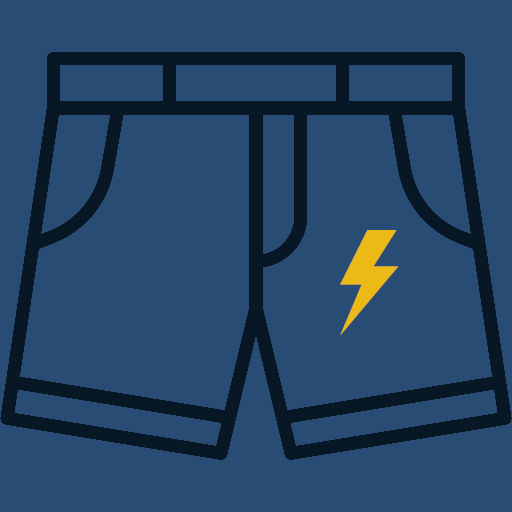

# BlazyShorts

Funny and experimental URL shorterner Powered by:
1. Rust
2. Leptos
3. Wasm
4. Axum
5. Protobuf
6. Docker
7. Surrealdb 
8. PWA

# TODOs
## phase 1: (backend) :heavy_check_mark: 
  1. Save and load from RAM :heavy_check_mark:.
  2. Add link :heavy_check_mark:.
  3. Redirect to link :heavy_check_mark:.
  4. Not Found :heavy_check_mark:.
  5. Modules :heavy_check_mark:.

## phase 2: (backend) :heavy_check_mark:
  1. Input validator :heavy_check_mark:.
  2. Logger middleware :heavy_check_mark:.
  3. Add database :heavy_check_mark:.

## phase 3: (shared-lib) :heavy_check_mark:
  1. shared api modules :heavy_check_mark:.

## phase 4: (front-end) 
  1. Simple landing page and routing.
  2. Add link form.

## phase 5: (backend)
  1. dockerize project
  2. configs:
    1. enable/disable hashmap cache on app_state (10 times faster)
    2. enable/disable file logging (10-20% faster)
  3. prevent link duplication on database

## phase 6: (shared-lib)
  1. Protobuf

## phase 7: (desktop installation)
  1. PWA
  2. Tauri

## phase 8: multiplatform rust
  1. core feature with different apis on diffrent platforms:
    alert/mod.rs
      alert_linux.rs
      alert_web.rs

## phase 9: (Mobile installation)
  1. Android with Tauri
    alert_android.rs?